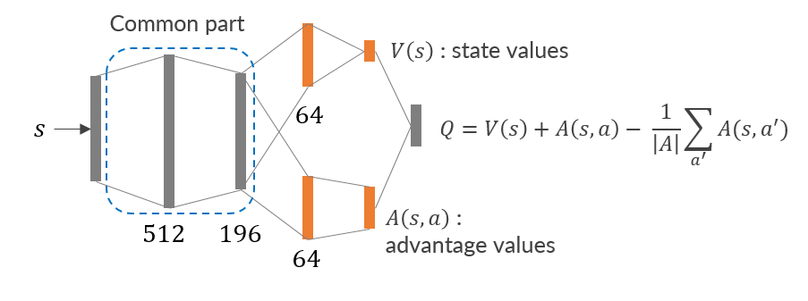
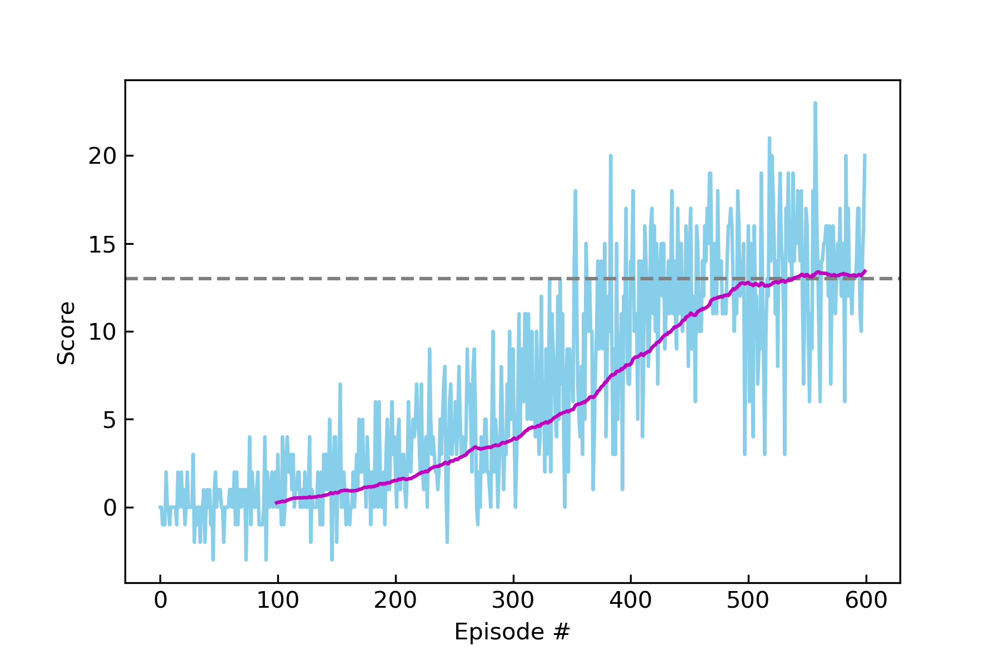
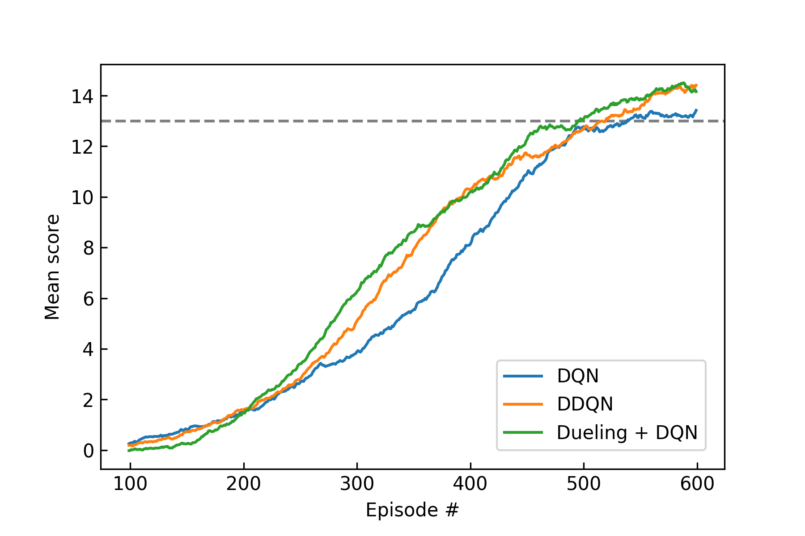

[//]: # (Image References)

[image1]: ./media/Bnana1.gif "Trained Agent"
[image2]: ./media/Bnana1-rot.gif "rotation"

# Report : Navigation in Banana Environment

## Learning Algorithm

**For this project, we implement the following algorithms and compare its performance under the condition of almost same model structure and hyperparameters.** 

- DQN
- Double DQN (DDQN)
- Dueling DQN
- Dueling DDQN

Through all algorithms above, we use a neural network as the function approximater of satate-action value function Q(s,a). This generally causes the instability of learning process and to prevent this we implement two basic features, **Experience replay** and **Fixed Q-Targets**. 

- **Experience replay** : 
    - During interacting with the environment, we store experiences, , at each time step t as a memory in a dataset (replay buffer)  whose size is _BUFFER_SIZE_. 

    - In the learning phase, minibatches of experiences, U(D), are uniformly sampled at random from the replay buffer for updating the Q-network (this random sampling reduces harmful correlations between time sequential experiences).

- **Fixed Q-Targets** : 
    - The purpose of learning is to optimize the following loss functions at iteration i,  
         , where  is Q-network parameters.

    - For DQN algorithm,  
          where  is the discount factor.
    
    - For Double DQN algorithm,  
          
        This target moderates the overestimation of DQN algorithm especially at early stages of learning.
    
    - The target network parameters  are only updated with  every _UPDATE_EVERY_ steps via soft update, θ_target = _TAU_*θ + (1 - _TAU_)*θ_target. 

## Hyperparameters

The following hyperparameters specify the learning structure (see `Agents.py`).

|name|value|description|
|:--:|:--:|:--:|
|BUFFER_SIZE|1e5|replay buffer size|
|BATCH_SIZE|64|minibatch size|
|GAMMA|0.99|discount factor|
|TAU|1e-3|for soft update of target parameters|
|LR|5e-4|learning rate of optimizer|
|UPDATE_EVERY|4|how often to update the target network|

## Parameters for training
- n_episodes (=**600**) : maximum number of training episodes
- eps_start (=**1.0**) : starting value of epsilon, for epsilon-greedy action selection
- eps_end (=**0.01**) : minimum value of epsilon
- eps_decay (=**0.995**) : multiplicative factor (per episode) for decreasing epsilon
- goal_score (=**13.0**) : average score to be required

## Network Structure

The network structure we used for this project is written in `model.py`.  
The corresponding parameters are as follow.

- hidden_layers (list): size of hidden_layers
- drop_p (float): probability of an element to be zeroed

1. Q-Network for DQN and DDQN
    - A single stream
    - 3 hidden layers with the size of 512, 196 and 64.
    - Relu activation function and dropout (drop_p=0.3) for each layer.

2. Dueling Network
    - Two streams
    - The common part of network is consists of 2 hidden layers with the size of 512 and 196.
    - The remain part of network estimating the state-value and advantage function has a hidden layer with 64 nodes respectively.
    - Relu activation function and dropout (drop_p=0.3) for each layer.
    - As pointed out in the [original paper][ref3], the mean of the advantage function is subtracted at the output layer (see below fig).
    

## Plot of Rewards

A reward of +1 is provided for collecting a yellow banana, and a reward of -1 is provided for collecting a blue banana.  Thus, the goal of the agent is to collect as many yellow bananas as possible while avoiding blue bananas.   
The task is episodic, and in order to solve the environment, your agent must get an average score of +13 over 100 consecutive episodes.

The following table shows the number of episodes needed to solve the environment for each algorithm. In the case of Dueling DDQN, the agent with the hyperparameters setting above did not achieve the score goal despite increase of the episode number. (see. [Navigation_Results_Example.ipynb](Navigation_Results_Example.ipynb))

||DQN|DDQN|Dueling DQN|Dueling DDQN|
|:--:|:--:|:--:|:--:|:--:|
|# of episodes to solve|439|417|396|N/A|

The learning process for each episode using DQN algorithm is illustrated in the left figure below. The magenta line denotes the average score over 100 successive episodes.  
The right figure below shows the average scores over 100 successive episodes via DQN, DDQN and Dueling DQN algorithm.

The following video is a behaviour of trained agent with DQN.
(cf. [Navigation_Watch_Agent.ipynb](Navigation_Watch_Agent.ipynb) )

![Trained Agent][image1]

## Ideas for Future Work

### Plan to implement the following extensions

- Prioritized experience replay
- Distributional DQN
- Learning from raw Pixels

 Although the performance with Dueling DQN is slightly higher than the other algorithms, we encountered a situation like the following video. (you can make the same things with saved weights, `weights/weights_Dueling_DQN.pth` in [Navigation_Watch_Agent.ipynb](Navigation_Watch_Agent.ipynb)

As you can see the video below, after collecting several yellow bananas the agent was surrounded by a wall and blue bananas, then lost the sight of targets and started walking around in circles. This is interesting and the action based on rewards. In other words, the agent judged that the action staying here is more valuable than taking the action that could potentially collect blue bananas. This may happens caused by low dimensionality of the state space, therefore algorithm via learning from raw pixels could resolve this problem.

![rotation][image2]

## Reference

- [Mnih, Volodymyr, et al. "Human-level control through deep reinforcement learning" Nature518.7540 (2015): 529.][ref1]
- [H. Hasselt, et al. "Deep Reinforcement Learning with Double Q-learning"][ref2]
- [Z. Wang, et al. "Dueling Network Architectures for Deep Reinforcement Learning"][ref3]

[ref1]: http://files.davidqiu.com//research/nature14236.pdf
[ref2]: https://arxiv.org/abs/1509.06461
[ref3]: https://arxiv.org/abs/1511.06581